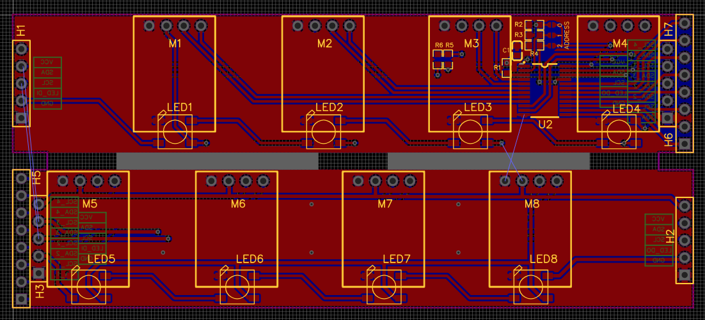
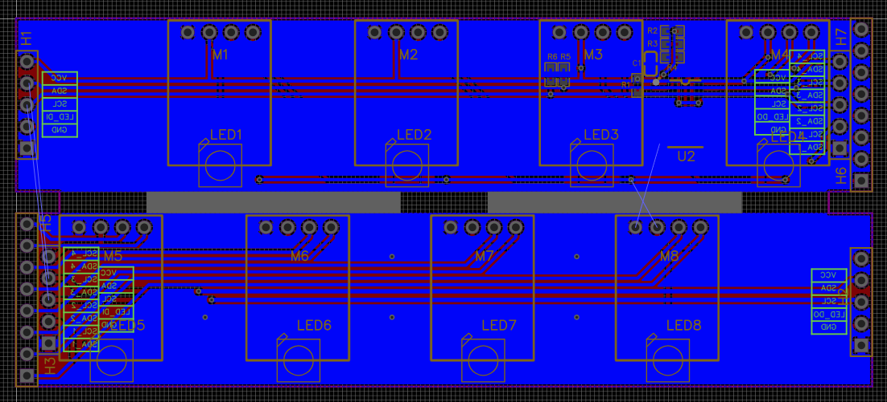
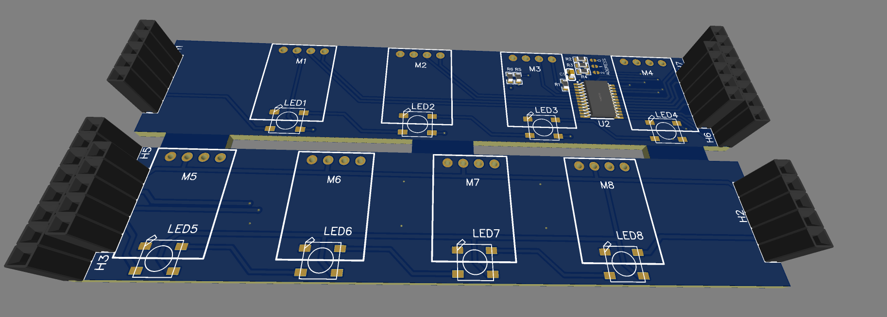
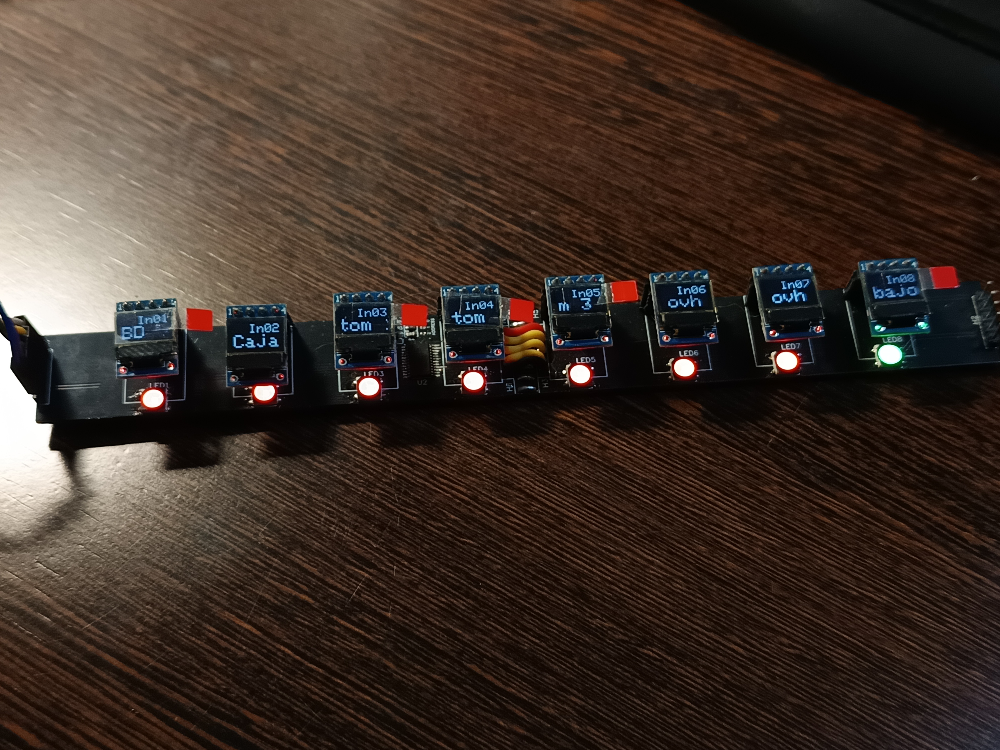

# X32 Producer scribble board

This projects aims to add 16 OLEDs screens and its RGB leds to complete the channel strips of the Behringer X32 Producer.

> [!IMPORTANT]
> THIS PROJECT IS CURRENTLY IN EARLY DEVELOPMENT AND NOT READY FOR DAILY USAGE IN SHOWS

The hearth of the project is a ESP32 with ethernet support (WT32-ETH01) board and a custom pcb mounting 8 I2C screens and 8 WS2812 RGB leds for each panel, multiplexing the I2C bus with an TCA9548A.

The idea is to daisy chain 2 panels, completing the 16 available faders in the X32 Producer

## PCB

The PCB is designed with easyEda, trying to fit everything in a board smaller than 100x100 mm to reduce the fabrication cost, due to the length of the fader banks, the PCB is panelized, resulting in a size of 100x43 mm

<figure>
  
  <figcaption>Top layer</figcaption>
</figure>

<figure>
  
  <figcaption>Bottom layer</figcaption>
</figure>

<figure>
  
  <figcaption>3D simulation of PCB</figcaption>
</figure>

<figure>
  
  <figcaption>Fully assembled PCB</figcaption>
</figure>

[Link to schematics](docs/schematic_X32-scribble.pdf)

## Software

The software is based on the Arduino platorm, developed with PlatformIO as development environment, and using the following libraries:
 - [fastLED/fastLed](https://github.com/FastLED/FastLED) for addressable LEDs communication
 - [adafruit/Adafruit SSD1306](https://github.com/adafruit/Adafruit_SSD1306) for OLEDs comunications
 - [ayushsharma82/ElegantOTA](https://github.com/ayushsharma82/ElegantOTA) for OTA updates
 - [CNMAT/OSC](https://github.com/CNMAT/OSC) to manipulate OSC messages